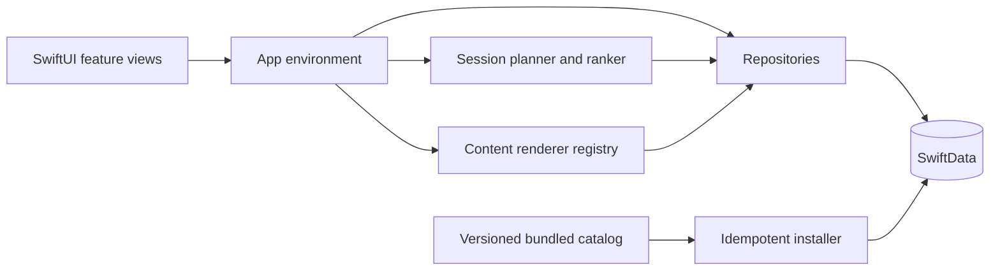

# Evolve

[](https://github.com/Win4ez-ru/Evolve/actions/workflows/ios.yml)

Evolve is a native, local-first iOS prototype for intentional self-development
scrolling. Its first product slice is **Focus Feed**: a finite, full-screen vertical
feed for focus and discipline that turns short content into understanding, a
thought, an action, or later recall.

## Current prototype

- Full-screen vertical paging with an explicit end-of-session summary instead of
  an endless feed.
- Duration-based plans for 5, 10, or 15 minutes, capped at 15 immutable session
  items.
- A balanced rhythm of four feed roles (`learn`, `test`, `reflect`, `do`) derived
  from six editorial interaction patterns: learn, quiz, reflect, apply, track,
  and recall. Due recall stays ahead of new discovery.
- 12 original, bundled Focus & Discipline units across attention, starting, and
  follow-through.
- Code-native cards with text, choice, number, code, and reflection interactions;
  objective checks provide immediate local feedback.
- Feed controls for saving an idea, marking it useful, writing a private thought,
  and opening its practice checkpoint.
- A local Growth Memory that keeps saved ideas, thoughts, linked actions, attempts,
  recall schedules, and learning state on the device.
- Action lifecycle support, including pending, completed, and skipped states.
- Local product events for impressions, fast skips, reversible usefulness,
  feed endings, thoughts, actions, earned sessions, and completed Growth Loops.
  Event payloads do not contain private thought text, and scrolling alone does
  not earn mindful minutes or a streak.
- Recall-first review, deterministic spaced repetition, remediation, and
  evidence-weighted progress.
- Onboarding and Profile settings for interests, goal, experience level, feed
  duration, daily goal, and appearance. The initial local ranker prioritizes due
  recall, the selected goal topic, learning state, and level fit.
- SwiftData production, preview, and in-memory test stores, plus idempotent catalog
  installation and personal-state preservation across catalog revisions.
- Semantic SwiftUI design tokens, light and dark appearances, Dynamic Type, Reduce
  Motion support, a privacy manifest, and an unsigned release verification flow.

The prototype requires no account, backend, Figma workflow, plugin, or paid
third-party service. Real video delivery, remote catalogs, accounts and sync, open
UGC and moderation, advertising, creator tools, and large-scale behavioral
personalization remain future product stages.

See `Docs/ProductDefinition.md` for the product contract and guardrails.

## Architecture

Evolve is a native, local-first SwiftUI application. Product state is persisted with
SwiftData, while deterministic services own catalog installation, session planning,
interaction evaluation, recall scheduling, and progress evidence.



The bundled editorial catalog is versioned independently from personal state. Catalog
upgrades are idempotent and preserve saved ideas, thoughts, actions, attempts, recall
schedules, and learning evidence.

See `Docs/Architecture.md`, `Docs/DomainModel.md`, and
`Docs/LocalFirstLearningLoop.md` for the detailed boundaries.

## How it works

1. The planner prioritizes due recall, then scores new material against the selected
   goal, experience level, and current learning state.
2. A finite 5-, 10-, or 15-minute plan is frozen for the session; scrolling never
   creates an endless feed.
3. Typed content blocks resolve to code-native renderers and interaction evaluators.
4. Objective checks, reflections, useful marks, thoughts, and actions update local
   evidence.
5. Deterministic scheduling turns that evidence into remediation, later recall, and
   progress views.

## Tech stack

- Swift 6.3 and SwiftUI
- SwiftData persistence with in-memory preview and test stores
- Swift Observation and Swift Testing
- WidgetKit and a privacy manifest
- Xcode build tooling and GitHub Actions

## Requirements

- Xcode 26.6 or newer
- Swift 6.3 toolchain
- iOS 18.0 deployment target

## Run

1. Open `Evolve.xcodeproj`.
2. Select the `Evolve` scheme.
3. Choose an iPhone simulator running iOS 18 or newer.
4. Build and run.

## Verify

Run the code-first release gate from the repository root:

```sh
./Scripts/verify-release.sh
```

It runs the `Evolve` test target on an iPhone simulator and compiles an unsigned
Release device build. Set `EVOLVE_DESTINATION` to select another installed
simulator.

Current automated coverage contains 61 Swift Testing tests for domain validation,
catalog decoding, migration and installation, persistence, rendering, finite
session planning and state, review scheduling, evidence scoring, Growth Memory,
action lifecycle, and local feed events.

## Product and design workflow

SwiftUI is the interface source of truth. Xcode Previews, simulator review, tests,
and the release verification script are the critical path. Figma remains optional
for a small number of high-value product or App Store compositions and cannot
block implementation or launch.

See `Docs/CodeFirstReleaseWorkflow.md` for visual QA and release checks, and
`Docs/Architecture.md` for the current application boundaries.

## TestFlight boundary

The codebase can be built and tested without signing. A real TestFlight upload
still requires a production bundle identifier, an Apple Developer team and signing
configuration, and a matching App Store Connect application record and metadata.

## Project status

The Focus Feed learning loop is implemented and locally testable. Evolve is a
portfolio prototype, not a released App Store product. Accounts, cloud sync, remote
catalogs, open user-generated content, advertising, and large-scale personalization are
explicitly outside the current scope.
